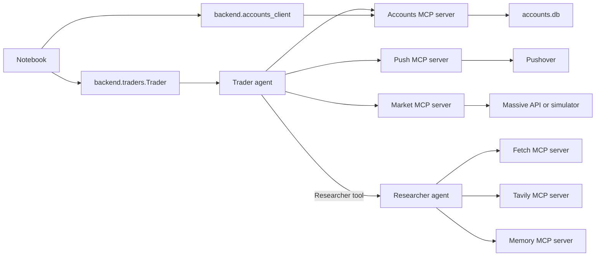

# `4_lab4.ipynb`: line-by-line explanation

This guide explains all 27 cells in [`4_lab4.ipynb`](4_lab4.ipynb), including every executable line, the helpers it calls, where its imports come from, and how the trading simulation fits together.

The notebook has **nine code cells**. The other cells introduce the architecture, show images, and give commands for running the dashboard and trading loop. The displayed share price, Amazon answer, and Visa transaction are **saved outputs from an earlier execution**. They are examples, not hardcoded values or guaranteed future results.


---


## 1. Overall architecture



An **MCP tool** is an operation an agent can call, such as `buy_shares`. An **MCP resource** is content a client reads by URI, such as `accounts://strategy/Warren`. The trader receives tools through the OpenAI Agents SDK. Separately, `backend.accounts_client` reads account and strategy resources and inserts their text into the trader's prompt. The Agents SDK runs the agent loop and invokes configured tools; the account, market, and notification behavior belongs to this repository or its external MCP servers. See the [official OpenAI Agents SDK overview](https://developers.openai.com/api/docs/guides/agents/sdk).


---


## 2. Cells 0–3: introduction and architecture

- **Cell 0** is HTML in a Markdown cell. The `<table>` lays out the `../assets/aaa.png` image beside the “Autonomous Traders” title and subtitle. Its `style`, `width`, and `height` attributes affect display only; they do not execute trading code.
- **Cell 1** names the six server roles: Accounts, push notifications, market data, Fetch, Tavily, and Memory. It also says the implementation lives in `backend`.
- **Cell 2** shows `../assets/architecture.png`. The orange boxes are agents and the blue boxes are MCP servers. A trader calls the researcher as a tool; each agent has a different set of servers.
- **Cell 3** shows `../assets/stop.png` and a warning about using the project for real trading decisions. This is presentation content, not a runtime check.


---


## 3. Cell 4: imports and environment setup

| Code line | Origin and effect |
|---|---|
| `from dotenv import load_dotenv` | Imports `load_dotenv` from the `python-dotenv` package. It loads `.env` variables into the process environment. |
| `import json` | Python standard library. Cell 22 uses `json.loads` to parse an account report. |
| `from contextlib import AsyncExitStack` | Python standard library. Manages a variable number of asynchronous context managers, here the researcher server connections. |
| `from agents import Runner, trace, add_trace_processor` | OpenAI Agents SDK, installed by the `openai-agents[viz]` dependency in [`../pyproject.toml`](../pyproject.toml). `Runner` executes agents; `trace` groups a workflow's activity; `add_trace_processor` installs an additional observer. |
| `from IPython.display import Markdown, display` | IPython/Jupyter display helpers. They render the researcher’s final answer as Markdown. |
| `from backend.market import get_share_price` | Local function in [`backend/market.py`](backend/market.py). Cell 9 calls it directly. |
| `from backend.accounts import Account` | Local Pydantic account model in [`backend/accounts.py`](backend/accounts.py). Cell 11 reads Warren’s account directly. |
| `from backend.accounts_client import read_accounts_resource` | Local raw MCP client helper in [`backend/accounts_client.py`](backend/accounts_client.py). Cell 22 uses it to read an Accounts resource. |
| `from backend.reset import reset_traders` | Local function in [`backend/reset.py`](backend/reset.py). It is imported, but the notebook comments out its call. |
| `from backend.mcp_servers import trader_mcp_servers, researcher_mcp_servers` | Local factories in [`backend/mcp_servers.py`](backend/mcp_servers.py). They construct MCP server connection objects. |
| `from backend.traders import get_researcher, get_researcher_tool, Trader` | Local agent builders and trader class in [`backend/traders.py`](backend/traders.py). |
| `from backend.tracers import LogTracer` | Local custom trace processor in [`backend/tracers.py`](backend/tracers.py). |
| `load_dotenv(override=True)` | Loads a discovered `.env` file and lets its values replace variables already set in the environment. The saved output `True` indicates that a dotenv file was loaded; it does **not** establish that every required API key exists. |

The `backend` imports resolve to code under `6_mcp/backend`. `agents`, `dotenv`, and `IPython` are installed packages; `json` and `contextlib` are standard-library modules.


---


## 4. Cells 5–6: Windows stdio workaround

Cell 5 explains that a stdio MCP subprocess may fail when a Windows Jupyter kernel gives its stderr stream no usable file descriptor. Cell 6 contains three explanatory comment lines, then four executable lines:

1. `import functools` makes Python’s `functools.partial` available. `partial` produces a callable with some arguments already filled in.
2. `import subprocess` makes `subprocess.DEVNULL` available. That constant directs output to the operating system’s null device.
3. `import agents.mcp.server` loads the Agents SDK module responsible for these local MCP connections.
4. `agents.mcp.server.stdio_client = functools.partial(agents.mcp.server.stdio_client, errlog=subprocess.DEVNULL)` replaces that module’s `stdio_client` reference with a wrapper that supplies `errlog=DEVNULL` on later calls. MCP server startup text on stderr is discarded.

This is a **process-wide monkey patch** in the notebook kernel. `MCPServerStdio` looks up that module-level `stdio_client` when opening its streams, so the patch affects the server objects used in later cells. It does not replace the separate `stdio_client` imported by [`backend/accounts_client.py`](backend/accounts_client.py). The patch must run before the affected server connections are opened.


---


## 5. Cells 7–9: market prices

Cells 7 and 8 introduce `backend` and the market-price example. Cell 9 consists of one expression:

`get_share_price("AAPL")` calls [`backend/market.py`](backend/market.py). Because it is the final expression in a notebook code cell, Jupyter displays its returned value without an explicit `print`. The saved output is `338.4`; a later run can produce another value.

The implementation follows this path:

1. At module import, `market.py` loads `.env` and reads `MASSIVE_API_KEY`.
2. With a key, `get_share_price` tries `get_share_price_massive`. That creates a Massive `RESTClient` and attempts last trade, ticker snapshot, then previous close. `plan_tier` remembers the first method that works so later calls start there.
3. If there is no key, or the Massive attempt fails, it calls [`simulated_price`](backend/market_simulator.py).
4. The simulator hashes the ticker to a repeatable seed, combines five layers of smoothly interpolated noise over time, applies them to a ticker-specific base price, and rounds to cents. Prices therefore depend on both the ticker and the time.

This cell calls Python directly. When the trader agent asks for a price through MCP, [`backend/market_server.py`](backend/market_server.py) exposes `lookup_share_price`, which calls the **same** `get_share_price` helper if no Massive MCP server is configured.


---


## 6. Cells 10–11: Warren’s account

Cell 10 introduces the accounts and notes that the reset call is deliberately commented out. Cell 11 does the following, line by line:

1. `# reset_traders()` is a comment, so it performs no reset. If uncommented, [`reset_traders`](backend/reset.py) resets Warren, George, Ray, and Cathie to $10,000 cash, their starting strategy strings, empty holdings, and empty transaction and value histories. It saves those changes.
2. `warren = Account.get("Warren")` calls the `Account` class method in [`backend/accounts.py`](backend/accounts.py). It reads Warren’s row using [`database.read_account`](backend/database.py), with the name normalized to lowercase. If no row exists, it creates and saves an account with $10,000 cash and an **empty** strategy. Pydantic builds an `Account` object from the stored fields.
3. `print("Balance:", warren.balance)` prints the account’s cash balance. It is not the combined value of cash and shares.
4. `print("Strategy:", warren.get_strategy())` calls `Account.get_strategy`, which writes an account log entry and returns the strategy text, then prints it.

The saved output shows Warren’s value-investing strategy because the database in that earlier run already contained it. A fresh database with the reset still commented out would yield an empty strategy.

The `Account` model stores `name`, `balance`, `strategy`, `holdings`, `transactions`, and `portfolio_value_time_series`. Each transaction stores a symbol, signed quantity, execution price, timestamp, and rationale. `buy_shares` gets a price, applies a 0.2% buy spread, checks available cash, updates holdings and balance, records a transaction, and saves. `sell_shares` applies a 0.2% sell spread, checks holdings, and records a **negative** quantity. Both write account logs and return a fresh JSON report. See [`backend/accounts.py`](backend/accounts.py).


---


## 7. Cells 12–13: six MCP servers and tool counts

Cell 12 says that [`backend/mcp_servers.py`](backend/mcp_servers.py) supplies different server sets to traders and researchers. Cell 13 executes each line in this order:

1. `servers = trader_mcp_servers() + researcher_mcp_servers("Warren")` constructs two lists and concatenates them. Each factory returns three `MCPServerStdio` objects, so `servers` contains six. Constructing these objects does not by itself start their child processes.
2. `count = 0` initializes the count.
3. `for server in servers:` iterates through the six objects.
4. `async with server:` starts and connects to that server, then closes its connection on leaving the block. The loop handles servers **sequentially**, one per iteration.
5. `tools = await server.list_tools()` sends an MCP request for that server’s visible tool definitions. `await` suspends this coroutine while the request runs.
6. `count += len(tools)` adds this server’s visible tool count.
7. `print(f"We have {len(servers)} MCP servers, and {count} tools")` reports six objects and the summed count. The saved run returned **17 tools**. External server versions and the market-data configuration can change the count.

The factory launches these servers:

| Agent | Server | Launch command | What it provides |
|---|---|---|---|
| Trader | Accounts | `uv run -m backend.accounts_server` | Balance, holdings, buy, sell, and strategy-change tools; account and strategy resources |
| Trader | Push | `uv run -m backend.push_server` | Push-notification tool |
| Trader | Market | `uv run -m backend.market_server` without a Massive key; otherwise Massive’s MCP server via `uvx` | Simulated-price lookup or Massive market tools |
| Researcher | Fetch | `uvx mcp-server-fetch` | Web-page fetching |
| Researcher | Tavily | `npx -y tavily-mcp@latest` | Web search; a static tool filter exposes only `tavily_search` |
| Researcher | Memory | `npx -y mcp-memory-libsql` | Persistent knowledge graph; for Warren, `LIBSQL_URL=file:./memory/Warren.db` |

`uv`, `uvx`, and `npx` are command-line launchers outside Python. The local server modules use the MCP Python package’s `FastMCP` decorators to register functions. For example, [`backend/accounts_server.py`](backend/accounts_server.py) registers five tools with `@mcp.tool()` and two resources with `@mcp.resource(...)`. Resources are **not** counted by `list_tools()`.


---


## 8. Cells 14–16: running the researcher

Cell 14 explains the researcher’s tool set and why Tavily is restricted to plain search. Cell 15 runs a single researcher request:

1. `async with AsyncExitStack() as stack:` opens an asynchronous cleanup stack. Everything entered into it is closed when this block exits, including when an exception occurs.
2. `servers = [await stack.enter_async_context(server) for server in researcher_mcp_servers("Warren")]` creates Warren’s Fetch, Tavily, and Memory server objects, starts each through the stack, and stores the connected objects. This assignment also replaces the earlier notebook variable named `servers`.
3. `researcher = await get_researcher(servers, "gpt-5.4-mini")` calls [`get_researcher`](backend/traders.py). It creates an Agents SDK `Agent` named `Researcher`, with `researcher_instructions()` from [`backend/templates.py`](backend/templates.py), the selected model, and the three connected MCP servers. The helper is declared `async`, although its body only constructs and returns an agent.
4. `with trace("Researcher"):` groups activity under a named SDK trace.
5. `result = await Runner.run(researcher, "What's the latest news on Amazon?", max_turns=30)` starts the Agents SDK loop. The SDK provides available MCP tools to the model, executes requested calls, returns their results to the model, and continues until the agent finishes or the turn limit is reached. The model determines the particular searches and answer.
6. `display(Markdown(result.final_output))` renders the final answer in the notebook. It runs **after** the `AsyncExitStack` closes the MCP connections; the answer is already stored in `result`.

[`researcher_instructions`](backend/templates.py) asks for multiple searches, memory retrieval and storage, a summary, and inserts the current datetime. The saved Amazon summary is one prior model result. Cell 16 links to the hosted trace viewer. See [official OpenAI documentation on local MCP connections and tracing](https://developers.openai.com/api/docs/guides/agents/integrations-observability).


---


## 9. Cells 17–18: making the researcher a tool

Cell 17 describes the agent-as-tool arrangement. Cell 18 has three executable lines:

1. `researcher_tool = await get_researcher_tool(researcher_mcp_servers("Warren"), "gpt-5.4-mini")` creates **new** researcher server objects, builds a researcher agent through `get_researcher`, then calls `researcher.as_tool(tool_name="Researcher", tool_description=research_tool())`. The tool description comes from [`backend/templates.py`](backend/templates.py).
2. `print("Tool name:", researcher_tool.name)` displays the configured tool name.
3. `print("Description:", researcher_tool.description)` displays the text the trader model will see to understand the tool’s purpose.

This cell constructs and inspects a tool; it does not run a researcher request. Later, a trader can call this tool with generated input. The researcher performs its own nested run and returns a result to the trader, while the trader remains responsible for the outer answer. A handoff would transfer ownership of the conversation instead. See [official OpenAI documentation on agents as tools](https://developers.openai.com/api/docs/guides/agents/orchestration).


---


## 10. Cells 19–20: running Warren

Cell 19 introduces [`Trader`](backend/traders.py) and the local trace processor. Cell 20 contains three lines:

1. `add_trace_processor(LogTracer())` creates and globally registers a [`LogTracer`](backend/tracers.py). Its callbacks observe trace and span start/end events, derive the trader name from the trace ID, and write short records into the SQLite `logs` table through [`database.write_log`](backend/database.py). The SDK’s normal exporter remains registered. Rerunning this cell registers another `LogTracer`, which can duplicate local log records.
2. `warren = Trader("Warren", "Patience", "gpt-5.4-mini")` creates a trader object. The constructor stores name, display surname, model name, `agent=None`, and `do_trade=True`. It does not trade yet.
3. `await warren.run()` starts the full asynchronous workflow.

The last line expands into this call chain:

1. `run()` calls `run_with_trace()`. It catches and prints exceptions, then flips `do_trade` for the next run—even if the current run failed.
2. `run_with_trace()` creates a trace ID containing Warren’s name and opens a `Warren-trading` trace. `LogTracer` uses that ID to associate trace events with Warren.
3. `run_with_mcp_servers()` opens all three trader servers and all three researcher servers with an `AsyncExitStack`.
4. `run_agent()` calls `create_agent()`. The trader agent receives the Accounts, Push, and Market MCP servers, plus the researcher as one ordinary tool.
5. `get_account_report()` calls `read_accounts_resource`, parses its JSON, removes `portfolio_value_time_series` to shorten the prompt, and serializes the remainder back to JSON.
6. `read_strategy_resource()` reads the strategy through a separate Accounts MCP resource call.
7. Because `do_trade` initially equals `True`, [`trade_message`](backend/templates.py) constructs the input prompt from the name, strategy, account report, market-data note, and current datetime. A later run of this **same** `Trader` object selects `rebalance_message` after the flag flips.
8. `Runner.run(self.agent, message, max_turns=30)` lets the model choose tools and actions. This method does not print the runner’s final output.

The prompt in [`backend/templates.py`](backend/templates.py) asks the trader to research, check price and cash, decide on trades, send a push summary, and give a brief appraisal. These are instructions to a model, not Python-enforced guarantees.

### Example execution path for a purchase

If the model chooses `buy_shares`, the flow is:

```text
Trader agent
  → Accounts MCP buy_shares tool
  → Account.get(name).buy_shares(symbol, quantity, rationale)
  → get_share_price(symbol)
  → update balance, holdings, and transactions
  → database.write_account(...)
  → SQLite accounts.db
```

The account method also logs the operation and returns a fresh JSON report to the tool caller. A separate [`Push server`](backend/push_server.py) tool makes an HTTP POST to Pushover when called.


---


## 11. Cells 21–22: reading the account afterward

Cell 21 explains the intent: inspect trades through an MCP resource. Cell 22 executes these lines:

1. `resources = await read_accounts_resource("Warren")` invokes the raw MCP client in [`backend/accounts_client.py`](backend/accounts_client.py). It launches the Accounts server over stdio, creates a `ClientSession`, calls `initialize()`, reads `accounts://accounts_server/Warren`, and returns `result.contents[0].text`.
2. `info = json.loads(resources)` parses that JSON string into a Python dictionary.
3. `print(info["transactions"][-1])` prints the last transaction dictionary. The saved output happens to be a Visa purchase. If the list is empty, `[-1]` raises `IndexError`.

The resource implementation in [`backend/accounts_server.py`](backend/accounts_server.py) calls `Account.report()`. Despite being named a **read** resource, [`report()`](backend/accounts.py) calculates portfolio value, appends a new timestamped portfolio-value point, saves the account, and writes a log before returning JSON. Reading this resource therefore has a database side effect.


---


## 12. Cells 23–26: full team, dashboard, and closing notes

Cell 23 displays a shortened loop using `asyncio.gather` followed by `asyncio.sleep`. The actual [`backend/trading_floor.py`](backend/trading_floor.py) registers `LogTracer`, creates persistent `Trader` objects for Warren, George, Ray, and Cathie, then repeats:

1. Check whether trading should run when the market is closed. With simulated data, `is_market_open()` returns `True`; with Massive, it asks the market-status API and also returns `True` if that request fails.
2. Run all four `trader.run()` coroutines concurrently using `asyncio.gather`.
3. Sleep for `RUN_EVERY_N_MINUTES * 60` seconds.

Environment settings are loaded at module import. `RUN_EVERY_N_MINUTES` defaults to `60`; `RUN_EVEN_WHEN_MARKET_IS_CLOSED` and `USE_MANY_MODELS` default to `false`. The latter selects either four `gpt-5.4-mini` entries or the four model names listed in the file. [`get_model`](backend/traders.py) routes names containing `/` to OpenRouter and names containing `deepseek`, `grok`, or `gemini` to configured `AsyncOpenAI` clients. Other names pass through for the SDK’s default OpenAI model path.

Cell 24 gives **terminal commands**, not notebook statements:

```bash
cd 6_mcp
uv run app.py
```

[`app.py`](app.py) launches the Gradio dashboard. [`demo/ui.py`](demo/ui.py) reads accounts and logs to render each trader’s value, chart, holdings, transactions, and activity. The dashboard does not start the trading loop.

In another terminal:

```bash
cd 6_mcp
uv run -m backend.trading_floor
```

That command starts the separate engine. Running both from `6_mcp` matters because [`backend/database.py`](backend/database.py) uses the relative filename `accounts.db`; processes started from different working directories may read different database files.

Cell 25 warns that the loop keeps making API calls until stopped. Cell 26 previews a separate frontend in the next lab; it executes no code.


---


## 13. Details that can change what you observe

- **Two forms of persistence:** account state and activity logs live in `accounts.db`; the researcher’s knowledge graph uses a separate `memory/<trader>.db` file. The code does not pass a conversation session to `Runner.run`, so later runs mainly recover prior information through these stored resources and the new account prompt.
- **Different tool visibility:** the trader sees the researcher as one tool; it does not directly see the researcher’s Fetch, Tavily, or Memory tools. Tavily is further filtered to `tavily_search`.
- **Saved notebook output is historical:** the `338.4` price, the Amazon summary, the count of 17 tools, and the Visa transaction describe a previous run. They can differ with configuration, time, server versions, and model choices.
- **The account resource is not read-only:** each `Account.report()` call appends a portfolio snapshot and writes a log. This includes both the trader’s prompt-building read and cell 22’s inspection read.
- **Trace registration persists within the kernel:** running cell 20 repeatedly installs additional `LogTracer` instances. Restarting the kernel clears those registrations.

