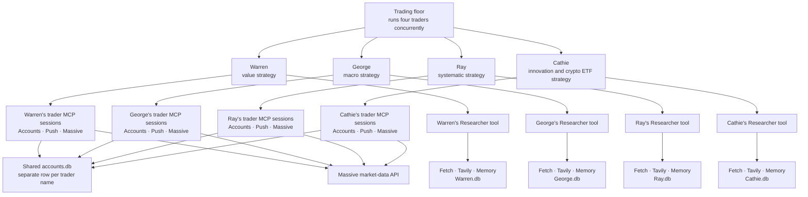

# How the Traders Use Massive MCP to Decide and Trade

With `MASSIVE_API_KEY` loaded, each trader can use **Massive market data to inform a decision**. Buying and selling still happen inside this project's simulation: the Accounts server updates `accounts.db`; it does not send an order to a brokerage.


## The four agents



“Own sessions” means [`Trader.run_with_mcp_servers()`](backend/traders.py) creates a fresh set of server connections for each trader's run. The four traders use the same server *code* and Massive key. Their account records are separated by name, while each researcher's memory file is separated by name. The researcher has Fetch, Tavily, and Memory; the trader calls that researcher **as one tool**.

With your key, [`backend/mcp_servers.py`](backend/mcp_servers.py) chooses the pinned Massive MCP server instead of the local simulated-price MCP server. That Massive version offers `search_endpoints` to find an API endpoint, `call_api` to request its data, and `query_data` to analyze results stored inside the Massive server. Its temporary market-data store is separate from the portfolio database. See [Massive's v0.10.0 server documentation](https://github.com/massive-com/mcp_massive/tree/v0.10.0).


## One possible Warren decision, step by step

The flow below uses plain text so it displays in Markdown viewers that cannot render Mermaid sequence diagrams. It illustrates one **possible** run; the model chooses which tools to call and may decide to hold instead.

```text
trading_floor.py starts Warren.run()
                 |
                 v
Trader reads Warren's account and strategy through Accounts MCP resources
                 |
                 v
Warren agent receives cash, holdings, transactions, and strategy
                 |
                 +----------------------+
                 |                      |
                 v                      v
       Researcher tool          Massive MCP server
                 |                      |
                 v                      v
      Tavily / Fetch / Memory    search_endpoints / call_api
                 |                      |
                 +----------+-----------+
                            |
                            v
                 Warren reviews the findings
                            |
                            v
                    Decide: BUY / SELL / HOLD
                       /         |         \
                      /          |          \
                  BUY           SELL          HOLD
                   |              |             |
                   v              v             v
          Accounts MCP       Accounts MCP     No trade
          buy_shares         sell_shares
                   \              /
                    \            /
                     v          v
                 Account.get("Warren")
                            |
                            v
              market.py requests a fresh price
              through Massive's Python REST client
                            |
                            v
              Check cash or shares; apply spread
                            |
                            v
              Update Warren's row in accounts.db
                            |
                            v
              Return updated account to agent
                            |
                            v
              Agent may call Push MCP to summarize
```

At the start, [`Trader.run_agent()`](backend/traders.py) reads the account and strategy through the separate resource client in [`backend/accounts_client.py`](backend/accounts_client.py). It builds a prompt containing that state. The trader can then ask its researcher for news, use Massive MCP for market data, and call Accounts MCP tools such as `get_balance` or `get_holdings` before deciding.

The **two Massive paths** are important:

- **Decision path:** The trader agent asks the **Massive MCP server** for market information. It can combine that information with the researcher's findings and the account state.
- **Trade path:** If the agent calls `buy_shares` or `sell_shares`, [`Account`](backend/accounts.py) independently calls [`market.py`](backend/market.py) for the price used in its cash calculation. `market.py` uses Massive's Python REST client, trying last trade, snapshot, then previous close. The earlier market-data result and this later price may differ. If the REST request fails, this code falls back to a simulated price.

The researcher does **not** call the Accounts or Massive MCP tools directly. It uses Fetch, Tavily, and Memory, then returns its findings to the trader. The trader makes the trade decision and calls the Accounts tool.


## Worked example: a hypothetical purchase

Suppose Warren has **$10,000 cash and no AAPL**, and research plus Massive data lead the agent to request a purchase of 10 shares. The earlier data seen by the agent might show **$200**, while the fresh price used by the Accounts server is **$201**. These are hypothetical numbers, not a price forecast or trade recommendation.

| Calculation | Result |
|---|---:|
| Price used by `buy_shares` | $201.00 |
| Buy price after 0.2% spread: `$201 × 1.002` | $201.402 per share |
| Cost of 10 shares | $2,014.02 |
| New cash balance | $7,985.98 |
| New holdings | 10 AAPL |

The Accounts server records the symbol, quantity, calculated buy price, time, and the agent's rationale in Warren's transaction history. On Warren's next run, it reads that updated portfolio. A later `sell_shares` call checks that Warren owns enough shares, fetches a **new** price, applies a 0.2% sell spread, adds proceeds to cash, and records the sale with a negative transaction quantity. See the [Accounts MCP tools](backend/accounts_server.py) and [account methods](backend/accounts.py).

When the full trading floor runs, [`backend/trading_floor.py`](backend/trading_floor.py) first checks market status, then runs the four traders concurrently. Each trader starts with an opportunity-finding prompt and alternates with a portfolio-rebalancing prompt on later runs.
