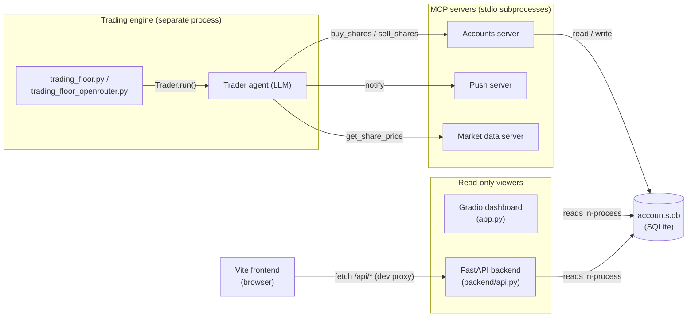
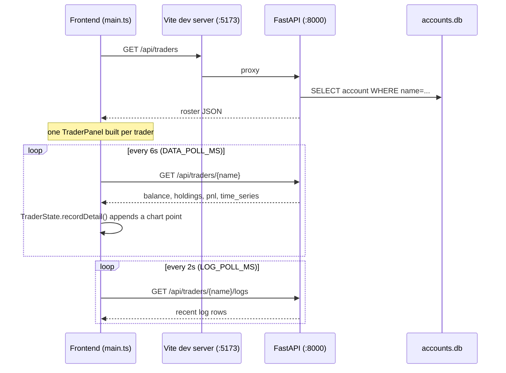
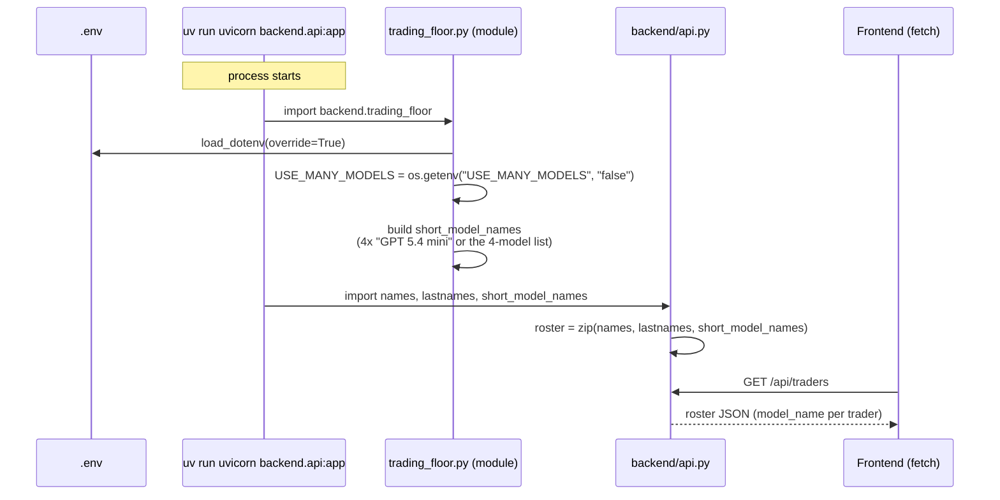

# Frontend & Backend Architecture

How the trading floor's backend (engine, MCP servers, database) connects to its two
read-only viewers: the Gradio dashboard and the standalone web frontend.

## System overview



Three processes run independently:

1. **The engine** (`uv run -m backend.trading_floor` or `trading_floor_openrouter`) —
   the only thing that ever writes to `accounts.db`. Everything else only reads it.
2. **A viewer** — either the Gradio dashboard (`uv run app.py`) or the FastAPI + Vite
   pair (`uv run uvicorn backend.api:app --port 8000` and `npm run dev`).
3. Nothing talks to a real market or broker; `get_share_price` is either Massive's
   live feed or `backend/market_simulator.py`, and "buying" a share means mutating a
   JSON blob in SQLite — see [backend/accounts.py](backend/accounts.py) for the
   mechanism.

## Backend

### Persistence: `accounts.db`

[backend/database.py](backend/database.py) opens one SQLite file with two tables:

- `accounts(name PRIMARY KEY, account)` — one row per trader, `account` is the
  entire `Account` model (`balance`, `holdings`, `transactions`, ...) serialized as
  one JSON blob via `write_account` / `read_account`. There's no per-field querying;
  every read/write replaces the whole blob.
- `logs(id, name, datetime, type, message)` — an append-only activity log, written
  by [backend/tracers.py](backend/tracers.py)'s `LogTracer` (hooks into the OpenAI
  Agents SDK's tracing to log every span start/end) and by `Account` itself on
  every balance/holdings/strategy change.

### The trading engine

[backend/trading_floor.py](backend/trading_floor.py) is the loop that actually
produces activity:

```python
while True:
    await asyncio.gather(*[trader.run() for trader in traders])
    await asyncio.sleep(RUN_EVERY_N_MINUTES * 60)
```

`USE_MANY_MODELS` (env var, read at import time via `os.getenv` after
`load_dotenv(override=True)`) picks whether all four traders share one model or
each gets a different one. [backend/trading_floor_openrouter.py](backend/trading_floor_openrouter.py)
is a copy that imports `Trader` from `traders_openrouter.py` instead, so every
model call is routed through OpenRouter with a single `OPENROUTER_API_KEY` rather
than needing separate keys per provider.

Each `Trader.run()` builds an `Agent` wired to three MCP servers (accounts, push,
market data) plus a researcher tool, and calls `Runner.run(agent, message,
max_turns=30)` — see [backend/traders.py](backend/traders.py). The LLM decides
whether to call `buy_shares`/`sell_shares`, which is what actually mutates
`accounts.db`.

### MCP servers

Three stdio subprocesses per trader (`backend/accounts_server.py`,
`backend/push_server.py`, `backend/market_server.py`), built by
[backend/mcp_servers.py](backend/mcp_servers.py). The accounts server is the only
one that touches the database — it exposes `buy_shares`, `sell_shares`,
`get_balance`, `get_holdings`, `change_strategy` as MCP tools, each just calling
the matching method on `Account`.

### HTTP API for the web frontend

[backend/api.py](backend/api.py) is a plain read-only FastAPI wrapper, run
separately with `uv run uvicorn backend.api:app --port 8000`:

| Route | Returns |
|---|---|
| `GET /api/traders` | roster: `name`, `lastname`, `model_name` per trader |
| `GET /api/traders/{name}` | full state: balance, strategy, holdings (enriched with live price and P&L), transactions, portfolio value time series |
| `GET /api/traders/{name}/logs?last_n=` | recent trace/account log lines |
| `GET /api/market` | price source (`massive`/`simulator`) and whether the market is open |

It imports `names`, `lastnames`, `short_model_names` from `trading_floor.py` at
module load time — this is what wires `USE_MANY_MODELS` through to the frontend
(detailed below). Every handler calls `Account.get(name)` directly, i.e. it reads
the same SQLite file the engine writes, with no caching layer in between.

## Frontend

`6_mcp/frontend/` is plain TypeScript + Vite — no React/Vue, just DOM
manipulation and one charting library (`uplot`). Key files:

- [frontend/src/api.ts](frontend/src/api.ts) — typed `fetch` wrappers for the four
  API routes above.
- [frontend/src/state.ts](frontend/src/state.ts) — `TraderState`, one per trader;
  holds the latest `TraderDetail` plus an in-memory time series that grows one
  point per poll.
- [frontend/src/panel.ts](frontend/src/panel.ts) — `TraderPanel`, renders one
  trader's card (balance, holdings, chart, log feed).
- [frontend/src/main.ts](frontend/src/main.ts) — entry point: builds one panel per
  trader, then polls.
- [frontend/src/chart.ts](frontend/src/chart.ts), `heatmap.ts` — uPlot chart and a
  holdings heatmap.
- [frontend/vite.config.ts](frontend/vite.config.ts) — dev server on `:5173`,
  proxies `/api/*` to `http://127.0.0.1:8000` so the browser only ever talks to one
  origin and there's no CORS to configure.

### Data flow

There's no websocket, no push from the server — the frontend polls on two
timers, set in `main.ts`:



So "live" here means "polled every few seconds," not streamed — each poll is a
fresh `Account.get(name)` read on the backend, which is cheap since it's one
indexed SQLite lookup.

## How `USE_MANY_MODELS` actually reaches the frontend

This is resolved once, at process startup, entirely on the Python side — the
frontend has no knowledge the env var exists.



Consequences worth knowing:

- Editing `.env` while `uvicorn` is already running does nothing until you
  restart it — the value is read once at import time, not per-request.
- `api.py` imports the roster from `trading_floor.py` specifically, not
  `trading_floor_openrouter.py`. That's harmless today only because both files
  compute `short_model_names` identically — the roster shown in the UI is
  metadata, decoupled from which engine process is actually placing trades.
