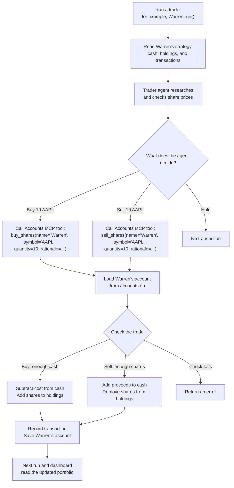

# Trading Floor Explained

## What this project is, in general

A multi-agent trading simulation built to demonstrate MCP. Four LLM "traders" —
each with a different investing persona (Warren/Buffett value investing,
George/Soros macro, Ray/Dalio systematic, Cathie/Wood crypto/disruptive) —
independently research and trade equities on a timer, using MCP servers for
accounts, push notifications and market data, plus a Researcher sub-agent (its
own MCP servers: fetch, Tavily search, memory). `trading_floor.py` runs all four
on a loop; everything persists in one local SQLite file, `accounts.db`; you watch
it through the Gradio dashboard or the separate FastAPI + Vite web frontend.

## Is any of this real?

Two different things, worth separating:

- **The prices can be real.** [`backend/market.py`](backend/market.py) calls the
  Massive market data API for live prices when `MASSIVE_API_KEY` is set, falling
  back to `market_simulator.py` only if that call fails.
- **The trading is always fake.** There is no brokerage, no order routing, no real
  account. [`backend/accounts.py`](backend/accounts.py) hardcodes
  `INITIAL_BALANCE = 10_000.0` — that constant, written once per trader when the
  account is first created (or on `reset_traders()`), *is* where "the money" comes
  from. Everything after that is arithmetic against real prices:
  `balance -= price * quantity`, written back to SQLite.

**Does MCP generate the money? No.** MCP is the wiring, not the funds — a
protocol that lets an LLM call ordinary Python functions as "tools" across a
process boundary. `buy_shares` is only an MCP tool in the sense that it's exposed
over stdio so the agent can call it; the function itself is nothing more than:

```python
self.holdings[symbol] += quantity
self.balance -= total_cost
self.save()
```

Swap MCP out for a direct function call and the economics are identical. If you
deleted every MCP server and called `Account.buy_shares()` directly in a script,
you'd get the same fake $10k-per-trader simulation. MCP just makes it possible to
plug tools into an LLM agent through a standard interface — the same way it plugs
in push notifications or web search.

So: real prices, invented money, no real trade ever leaves your machine.

## How a trade happens

Each trader is an agent that can **ask the Accounts MCP server to buy or sell
shares**. The server changes that trader's saved account. The notebook never
calls `buy_shares()` directly; `await warren.run()` starts the agent, and the
agent decides whether to call it.



### Example purchase

Suppose Warren starts with **$10,000 cash and no AAPL shares**. If the quoted
price is $100 and the agent buys 10 shares,
[`Account.buy_shares()`](backend/accounts.py) applies the code's 0.2% buy spread.

```text
Cost = 10 × $100 × 1.002 = $1,002
```

Warren then has **$8,998 cash and 10 AAPL shares**. The purchase is saved as a
transaction.

### Example sale

If Warren later sells those 10 shares at a quoted price of $110,
[`Account.sell_shares()`](backend/accounts.py) applies the 0.2% sell spread.

```text
Proceeds = 10 × $110 × 0.998 = $1,097.80
```

Warren then has **$10,095.80 cash and no AAPL shares**. These prices are only an
example; the program looks up prices when each trade occurs.

## How the four portfolios stay separate

The four traders use the same Accounts server code, but each trade supplies an
account **name**. `Account.get("Warren")`, `Account.get("George")`, and so on
load different rows in [`accounts.db`](backend/database.py). On the next run,
each trader reads its saved cash, holdings, and history, so its portfolio carries
forward.

The agent is prompted to use its own name. The Accounts tool itself selects the
row from the `name` argument it receives.
